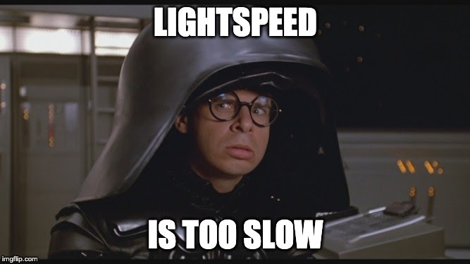
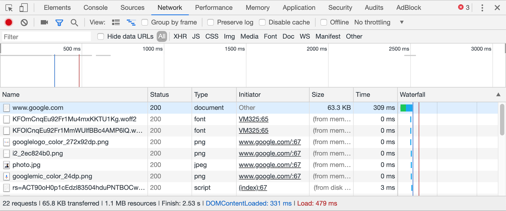
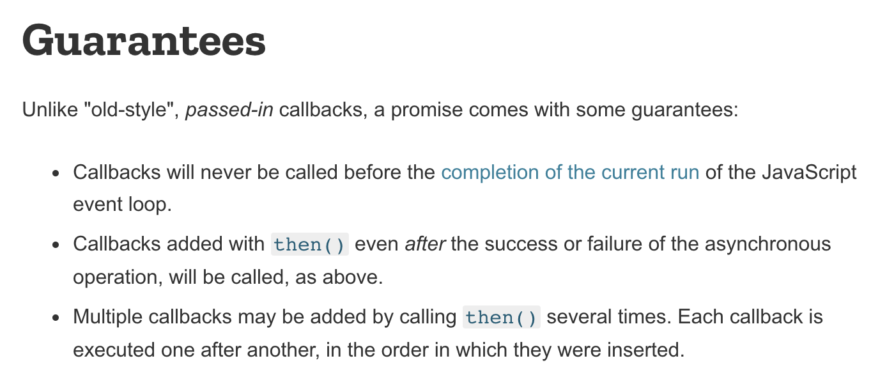
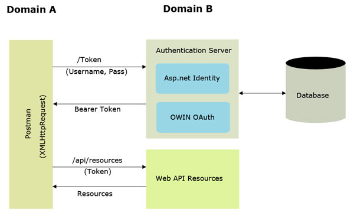

class: center, middle

# MPCS 52553-2: Web Development
## Week 5: Async and APIs
---

class: agenda

# Asynchronous Javascript
- setTimeout
- The Javascript Event Loop
- Promises
- fetch

# Python and Flask
- Choosing Frameworks

# Web API Design Patterns
- Token-based authentication
- Magic links

# Labs
- SetTimeout: Egg Timer
- Fetch and Promises: Random Concept Walk
- APIs and Flask: Row Row Row Your Boat API
---

# Asynchronous Javascript


???

Show of hands, who here has written asynchronous or concurrent code before? You
might have used threads in C, or a library with “Worker” or “Executor” in the
name.

OK, some of you. Was that easy? Nod your head for yes, concurrency is easy,
shake your head for no, concurrency is hard. Right, it’s hard. There’s a reason
concurrency is always taught in the last lecture or two of your programming
classes.
---

# Synchronous Javascript

Remember, the first version of Javascript was written by one person in 10 days
in 1994.

### Javascript is Single-Threaded.

### Straightforward, simple.

### Doesn’t demand browsers or client machines support multi-threading.
---

# When is Synchronous Too Slow?



???

- Very large computation
- Manipulating a large or deeply-nested DOM tree
- Any HTTP request
---

# When is Synchronous Too Slow: HTTP


---

# setTimeout

https://developer.mozilla.org/en-US/docs/Web/API/WindowOrWorkerGlobalScope/setTimeout

```javascript
let myGreeting = setTimeout(function() {
  console.log('Hello!');
}, 2000)

console.log('Howdy!');
```

Howdy!
Hello!
---

# Lab: Egg Timer

Make a page with a text entry field and a button called 'Set Timer'. When a user
puts a number in the field and clicks the button, wait that many seconds then
log "Ding!" to the console. Make sure you let users set multiple timers at once!

https://developer.mozilla.org/en-US/docs/Web/API/WindowOrWorkerGlobalScope/setTimeout

```javascript
let myGreeting = setTimeout(function() {
  console.log('Hello!');
}, 2000)

console.log('Howdy!');
```

---

# The Javascript Event Loop


https://developer.mozilla.org/en-US/docs/Web/JavaScript/EventLoop
---

# Lab: Sequential Asynchronous Functions

The time passed to setTimeout is a minimum, not a guarantee. What are some ways
we could can we make asynchronous calls happen in succession?

# Callback Heck

```javascript
let threeThings = setTimeout(function oneThing() {
  console.log(“one thing”);
  let thingTwo = setTimeout(function anotherThing() {
    console.log(“another thing”);
    let thingThree = setTimeout(function aThirdThing() {
      console.log(“a third thing”);
    }, 0)
  }, 0)
}, 0)
```
---

# Promises

https://developer.mozilla.org/en-US/docs/Web/JavaScript/Reference/Global_Objects/Promise


---

# Promises

https://developer.mozilla.org/en-US/docs/Web/JavaScript/Reference/Global_Objects/Promise

```javascript
new Promise((resolve, reject) => {
    console.log('one thing');
    resolve();
}).then(() => {
    console.log('another thing');
}).then(() => {
  console.log('a third thing');
})
```

Now there's a correspondence between how the code reads on the page and how it's
executed by the interpreter. That makes it a lot more readable and maintainable.

Remember that your primary audience when you write software is for other humans
to read, more than for a machine to execute.
---

# Promises

If we clean up the function definitions so the functions actually return Promise
objects, we can make it even neater:

```javascript
oneThing()
.then(() => anotherThing())
.then(() => aThirdThing())
```
---

# An Example Promise

```javascript
function myAsyncFunction(url) {
  return new Promise((resolve, reject) => {
    const xhr = new XMLHttpRequest();
    xhr.open("GET", url);
    xhr.onload = () => resolve(xhr.responseText);
    xhr.onerror = () => reject(xhr.statusText);
    xhr.send();
  });
}
```

You pass executor two functions, **resolve** and **reject**.

???

Resolve is what to do when the bottle washes ashore. “Take this green button.
Someone will press it when you wash ashore.”

We can’t return a value because there’s no context to return it into. We’re not
going to stand on the beach waiting for the bottle to wash up. That’s the whole
point! We’ve got stuff to do.

So we stick in there a green button. “Press this when you wash up.  We’ll pick
you up”

But the ocean is treacherous! Something might go wrong out there. So you also
put in a red button called reject.

If anything goes wrong out there and our bottle isn’t coming back, press the red
button.

We won’t go looking for you, but we’ll know we need to throw another bottle.
Sorry, the internet is a rough place.

We also press the red button if there’s some kind of problem in the bottle
factory.
---

# Promise Guarantees

https://developer.mozilla.org/en-US/docs/Web/JavaScript/Guide/Using_promises#Guarantees



???

So far this has been the same as setTimeout. We can kick off a process we won’t
wait for, and give it a success callback and a fail callback.

But Promises do some things setTimeout doesn’t.

First, callbacks won’t interrupt the current event loop. Bottles can’t interrupt
you. They wash up on the beach, I’m off doing something else, I’ll get back to
them. Fine. There’s your thread safety.

Now where it gets exciting is where the bottle metaphor starts to break down.
Or at least get a little magical.

You can keep putting new messages in the bottle, more green buttons, after
you’ve already thrown it. You call .then() on a Promise after it’s been created,
while the asynchronous operation is already running.

And not just because you know it won’t wash up until you walk away. You can walk
away, come back, and stuff more messages into a bottle that’s floating out there.

You can even stuff messages into a bottle that’s already washed up, into a
Promise that’s already resolved. They pop right back out again when you’re done.
It just sticks them right on the queue.

You can also chain them. Tell bottles to launch new bottles, and they’ll
dutifully remember the order they’re supposed to go in.

They pass the result of their result function on the next bottle, so you can
compose multiple asynchronous steps.

And because new callbacks can be added after, you can build the chain without
worrying about whether the first links have finished yet. The bottles stay on
the beach, awaiting further instructions.
---

# Promise Failure

```javascript
doSomething()
.then(function(result) {
  return doSomethingElse(result);
})
.then(function(newResult) {
  return doThirdThing(newResult);
})
.then(function(finalResult) {
  console.log('Got the final result: ' + finalResult);
})
.catch(failureCallback);
```

???

Another nice thing they to is return errors if they’re passed one

So errors propagate down the chain the way they would down the stack and you can
handle them once at the end

Here if any one of the functions fails you will hit the failureCallback
---

# Lab: Random Concept Walk

Write a page with a text entry field and a search button. Run the query through
one of our related concepts APIs. Pick a random response and run *that* through
the API. Repeat three more times, for a related concepts chain that's five items
long, including the original query. Log the results to the console.

```javascript
new Promise((resolve, reject) => {
    console.log('one thing');
    resolve();
}).then(() => {
    console.log('another thing');
}).then(() => {
  console.log('a third thing');
})
```

Hint: You may want to use javascript's [Fetch](https://developer.mozilla.org/en-US/docs/Web/API/Fetch_API/Using_Fetch)
method, which sends AJAX requests and returns Promises natively.

```javascript
console.log(query);
let request = fetch(MS_API + "?instance=" + query)
request.then((result) => {
  // parsed = parse result json
  // q2 = pick a suggested concept at random
  console.log(q2);
  return fetch(MS_API + "?instance=" + q2)
}).then((result)=>{
  ...
}).then ...
```
---

# Python and Flask

**[Editorial]** We're now halfway through the course, and going to start to
depart from pure standards or tools chosen for their historical importance.
There are any number of perfectly fine server-side languages you could use, each
with fierce partisans. And because HTTP is a well-defined spec, all of them can
do a totally capable job of running web servers. We've already used PHP, and
talked about how early web servers were mostly written in C and Java. There are
popular web frameworks written in Ruby (Rails, Sinatra), Python (Django, Flask),
and even Javascript itself (Node). There are web frameworks for newer languages
like Go (Gorilla, Gin) or Rust (Actix, Iron), and a friend even made a popular
[web framework for Fortran](https://fortran.io/).

Arguments about what's the "best" language and framework are contentious because
of the same kinds of positive feedback loops we've discussed around browsers
and the HTML spec. How _valuable_ my skills and experience with a given language
or framework are is partly a function of how _popular_ those choices are with
other developers. That makes discussions frequently generate more light than
heat. The truth is there are lots of perfectly good ways to write a web
application, and we should hold our choices somewhat lightly.

---

# Python and Flask

That said, sometimes you do have to just pick something.

https://www.python.org/

https://palletsprojects.com/p/flask/

We're going to adopt Python for the remainder of the course because it's a very
popular web language that's *also* used for lots of other general-purpose
programming tasks. If you're working on a web project with non-engineers who do
some coding, Python is most likely to be the language you both know.

Similarly, we're going to use Flask because it's widely used, and also
lightweight and relatively un-opinionated about how to structure web
applications.
---

# Lab: Row Row Row Your Boat API

If you already have an earlier version of Python you use for other projects, you
may want to install [pyenv](https://github.com/pyenv/pyenv) first.

Make a Flask app that returns the lyrics of a children's song.

As a stretch goal, add an endpoint that lets you add verses.

```python
from flask import Flask
app = Flask(__name__)

@app.route('/')
def hello_world():
    return 'Hello, World!'
```
---

# Cookies

One disadvantage of web browsers as an execution environment is security: users
are constantly downloading and executing arbitrary, untrusted Javascript code
from third parties. You don't really want to be storing passwords or API keys in
places where Javascript can get to them. But you often want *some* kind of
persistence so the user doesn't get logged out if they refresh the page or close
the tab.

One way to do that is with
[Cookies](https://developer.mozilla.org/en-US/docs/Web/HTTP/Cookies),
small files the browser stores and can then include in subsequent HTTP requests.
By default, Cookies can be restricted to only get sent to the domain that
created them, and can be created with the
[HttpOnly flag](https://developer.mozilla.org/en-US/docs/Web/HTTP/Cookies#restrict_access_to_cookies)
to make them inaccessible with Javascript.

Here's a good example of reading and writing cookies with Flask:
https://stackoverflow.com/a/46664792
---

# Token-Based Authentication

Another thing that API designers will do, especially for APIs that won't just be
used in the browser, is to have the user enter their secure credentials once,
and then to give the user a **time-limited** access token. That can be used more
safely in Javascript code than a durable password or API key, because if an
attacker is somehow able to steal it, it's likely to already be expired. We call
these session tokens, because they're only intended to last the life of one user
session.

The API will then store those access tokens on the server and check whether
incoming requests (1) have a token (2) that the server knows about and (3) has
not yet expired.


---

# Magic Links

Long, strong passwords can be clumsy to enter, especially on mobile devices
(which may be powered by the same API as the web app!).

Slack popularized an alternative: send the user a "magic link" that contains a
long, unique identifier that functions as a one-time password to log the user in.
That's no less secure than having a password reset link or form that sends a
message the same way, and considerably more convenient.

The server just needs to generate one-time passwords and save them, and then
have an API endpoint for users to make requests to. If they make one with a
one-time password that hasn't been used, it authorizes them (possibly setting a
cookie or sending a session token) and [redirects them](https://developer.mozilla.org/en-US/docs/Web/API/Window/location)
to the appropriate page.

https://www.waveguide.io/examples/entry/passwordless-login/
